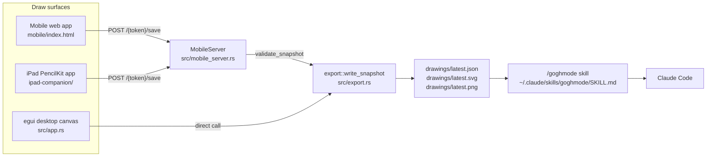

# Architecture

> **Audience:** developers. How the system fits together — read before
> contributing. Update this when a **structural pattern** changes (not for
> per-screen detail — that lives in [specs/](specs/README.md)).

GoghMode is one Rust binary that draws, serves, and exports, plus two client
surfaces that feed it. Everything is local: one machine, one Wi-Fi network, no
services.

## Stack

| Piece | Why it's here |
| --- | --- |
| Rust 2021, `rust-version = 1.78` | The desktop app, the local server, and the exporters are one binary. |
| `eframe` / `egui` 0.34 | Native macOS window and immediate-mode UI. The canvas is an `egui::Painter`, not a widget tree. |
| `clap` 4.5 (derive) | Three subcommands plus `--drawings-dir`. |
| `serde` / `serde_json` 1.0 | `DrawingSnapshot` is the cross-platform wire format; `serde_json` also parses untrusted upload bodies. |
| `image` 0.25, `default-features = false`, `features = ["png"]` | PNG encode only. GoghMode rasterizes by hand, so no decoders or other codecs are pulled in. |
| `arboard` 3.6 | Clipboard for both text (prompt, mobile URL) and raw RGBA images. Nothing in std does this. |
| `home` 0.5 | Resolves `$HOME` for the skill path, app bundle, `~/Pictures` fallback, and the token file. Replaces the deprecated `std::env::home_dir`. |
| `anyhow` 1.0 | One error type across install, export, and server paths; `main` prints and exits 1. |
| `tempfile` 3.10 (dev) | Tests never write into the real `drawings/`, `~/.claude`, or `~/Applications`. |
| SwiftUI + PencilKit, iOS 17 | The iPad companion. Native only — see [ADR-0005](decisions/0005-native-swiftui-over-flutter.md). |
| Vanilla HTML/CSS/JS | The mobile web app. No build step, no framework, four files. |

**Deliberate absences.** No HTTP framework, no async runtime, no TLS, no mDNS or
Bonjour, no QR crate. The mobile bridge is `std::net::TcpListener` plus
`include_bytes!` — see [ADR-0004](decisions/0004-no-http-framework.md).

## System diagram



All three surfaces speak the same `DrawingSnapshot` shape, and all writes funnel
through one function.

## Folder structure

| Path | Contents |
| --- | --- |
| `src/` | The whole Rust binary — see the module table below. |
| `mobile/` | The web sketchpad, compiled into the binary with `include_bytes!`. |
| `ipad-companion/` | Xcode project for the native companion, plus `ExportOptions.plist` for App Store Connect. |
| `tests/` | Integration tests. They re-include `src/` files (see **Conventions**). |
| `drawings/` | Output. Gitignored. Not present until the app has run once. |
| `docs/` | This documentation tree. |
| `.github/workflows/` | One workflow: iPad TestFlight delivery. |

### Rust modules

| File | Responsibility |
| --- | --- |
| `src/main.rs` | Entry point, clap CLI, module root, drawings-directory resolution, window setup. |
| `src/app.rs` | `GoghModeApp` — toolbar, canvas input, clipboard actions, status bar. Owns the `MobileServer`. |
| `src/drawing.rs` | Pure in-memory stroke model: `Point`, `Stroke`, `CanvasSize`, `DrawingSnapshot`, and the `Drawing` mutation API. No I/O, no UI. |
| `src/export.rs` | Snapshot → SVG string, RGBA raster, JSON; the atomic write of the three `latest.*` files. |
| `src/mobile_server.rs` | Blocking HTTP/1.1 server: serves the embedded web app, accepts snapshot uploads, validates them. |
| `src/prompt.rs` | Two hardcoded prompt strings (generic and Claude) plus `PromptTarget`. |
| `src/skill.rs` | The embedded `SKILL.md` text and its installer. |
| `src/app_install.rs` | Builds `~/Applications/GoghMode.app` — plist, launcher script, binary copy, ad-hoc codesign. |

## The wire contract

`DrawingSnapshot` (`src/drawing.rs:26-32`) is the single cross-platform schema:

```jsonc
{
  "schemaVersion": 1,
  "canvas":  { "width": 1100.0, "height": 699.5, "background": "#ffffff" },
  "strokes": [
    { "id": "stroke-1", "color": "#111827", "width": 4.0,
      "points": [ { "x": 12.5, "y": 40.0, "pressure": 0.5, "t": 1785312000000 } ] }
  ]
}
```

It is mirrored by hand in two other languages:

- `ipad-companion/GoghModeCompanion/DrawingSnapshot.swift:6-30` — plain `Codable`,
  no key strategy, so Swift property names *are* the wire names.
- `mobile/index.html` — built literally in `snapshot()`.

**Changing this schema means changing three implementations plus `validate_snapshot`
in the same breath.** The Swift tests assert the JSON key shape against the Rust
struct for exactly this reason.

Two fields carry different meanings per client, deliberately: `t` is epoch
milliseconds from the web app and a per-stroke monotonic offset from the iPad;
`pressure` is a real pen reading on iPad, `0.5` everywhere else. Nothing downstream
depends on `t` being a wall clock.

## Data flow (reading and writing)

There is no database, no cache, and no read path. Data moves one way:

1. A surface builds a `DrawingSnapshot` from its own in-memory strokes.
2. Desktop calls `export::write_snapshot` directly; mobile and iPad POST JSON to
   `/{token}/save`, and the server deserializes, validates, then calls the same
   function.
3. `write_snapshot` writes `latest.json.tmp`, `latest.svg.tmp`, `latest.png.tmp`
   and renames all three into place.
4. The agent reads the files. Nothing reads them back into the app.

### Bridge invariants

These four hold today and must keep holding:

1. **The Mac owns the output directory.** No client writes to it directly.
2. **Every writer goes through `export::write_snapshot`.** No parallel file format,
   no second serializer.
3. **The prompt and skill always point at `drawings/latest.*`.**
4. **A failed transfer must not corrupt the last good drawing** — hence the
   `.tmp` + rename, and hence validation before any file is touched.

## The mobile server

Hand-written HTTP/1.1 on a blocking `TcpListener`, one thread, connections handled
sequentially, `Connection: close` on every response.

- Binds `0.0.0.0:8787`; **on any bind failure it falls back to port 0** (an
  ephemeral port). See **Known failure modes**.
- The listener is non-blocking and the accept loop polls at 25 ms, checking an
  `AtomicBool` shutdown flag. `Drop` sets the flag and self-connects to unblock
  `accept`, then joins the thread — so server lifetime equals app lifetime.
- The displayed URL uses `preferred_lan_ip()`: bind a UDP socket, `connect()` to
  `8.8.8.8:80` without sending anything, read back the local address. Falls back to
  `127.0.0.1`.
- All four web assets are `include_bytes!`-compiled in, so the binary is
  self-contained. Every response sets `Cache-Control: no-store`.

Full route table, status codes, and limits: [mobile-server-api](specs/components/mobile-server-api.md).

### Reading a request body

The one genuinely tricky loop. `read_http_request` reads until `\r\n\r\n`, parses a
case-insensitive `Content-Length`, then keeps reading until
`header_end + 4 + content_length` bytes are buffered. Body is sliced to exactly the
declared length.

Before any of that, `handle_connection` **clears the non-blocking flag the accepted
socket inherited from the listener** and sets a 10-second read timeout. Without
that, on macOS every read past the first returns `WouldBlock`, so any upload
spanning more than one TCP segment failed with a bare 400. That was the bug in
commit `1877248`; `tests/mobile_server.rs` now sends a 4000-point drawing in 16 KiB
chunks to keep it fixed.

## Trust model

There is authentication, of a sort, and it is worth being precise about what it
covers.

- The token is 16 random bytes hex-encoded, read from `/dev/urandom` with a
  time-and-PID fallback, persisted at `~/.goghmode/mobile-token` so home-screen
  shortcuts survive restarts.
- **The token is the route prefix**, not a header: everything lives under
  `/{token}/`. Clients need no auth code at all — the web app just does a relative
  `fetch("save")`.
- There is no `Authorization` header, no cookie, no CSRF token, no origin check,
  and no TLS. Anything on the same LAN that knows the path can POST a drawing.

That is the accepted risk for a tool that only ever runs on a home or office
network while its window is open. Reasoning and what would change it:
[ADR-0002](decisions/0002-token-in-path-lan-pairing.md).

The real trust boundary is `validate_snapshot`, which rejects anything malformed
*before* a file is written, and returns a **named** reason so the client can say
something useful. Limits are listed in
[mobile-server-api](specs/components/mobile-server-api.md).

## Where output lands

`default_drawings_dir_for_executable` picks the directory from the running
executable's path:

- Launched from a terminal → `./drawings/` relative to the working directory.
- Launched from `GoghMode.app` → `~/Pictures/GoghMode/drawings/`, forced by the
  bundle's launcher script passing `--drawings-dir`.
- `--drawings-dir <path>` overrides both.

This is why the prompt text and the `/goghmode` skill both check the two locations.
The app bundle's `Contents/MacOS/GoghMode` is a shell script, not the binary — the
real binary lives in `~/Library/Application Support/GoghMode/goghmode-bin` and the
launcher runs it under `nohup /usr/bin/env -i` with a scrubbed environment so the
process escapes the LaunchServices app context.

## Known failure modes

Documented rather than fixed. Each is a live item in [PLANNING.md](PLANNING.md).

| Behaviour | Effect |
| --- | --- |
| Port 8787 taken → silent fallback to an ephemeral port | The token is stable, so a stale iPad URL still *looks* right while pointing at a dead port. Presents as an `Offline` badge no retry can fix. |
| PNG export ignores `stroke.color` | Raster output is always ink `#111827`, while SVG and JSON honour the colour. iPad colour choices show up in the SVG only. |
| SVG background is hardcoded `#ffffff` | The web app's cream paper tone (`rgb(250, 249, 244)`) is dropped on export. |
| Mobile service worker caches the app shell forever | A change to `mobile/index.html` does not reach an installed progressive web app until the cache name `goghmode-mobile-v1` is bumped. |

## Conventions

- **Binary-only crate — there is no `lib.rs`.** Integration tests therefore
  re-include source files with `#[path = "../src/x.rs"] mod x;` rather than
  `use goghmode::…`. Adding a module that tests need means adding another `#[path]`
  line, not an export.
- Test-only constructors live behind `#[cfg(test)]` **in the production file**
  (`start_loopback_for_test`), which only works because of that include trick.
- Rejection paths return `&'static str` reasons and log
  `goghmode: rejected upload: {reason}` to stderr. A bare "invalid" is useless to
  someone holding an iPad.
- Prompt and skill text contain no shell metacharacters — asserted by a test,
  because users paste them into a terminal.
- Descriptive names throughout; comments explain *why*, not what.

## Testing

```bash
cargo test                      # 32 Rust tests: 4 unit, 28 across 7 integration files
```

| File | Covers |
| --- | --- |
| `tests/mobile_server.rs` | Routes, redirect, 404/405, happy-path save, **multi-packet upload**, 400 with no file written. |
| `tests/export_snapshot.rs` | JSON/SVG/PNG output, empty drawing, out-of-bounds handling, no `.tmp` residue, raster dimensions. |
| `tests/mobile_web_assets.rs` | Static assertions over `mobile/*` source text — schema version, `fetch("save")`, pointer events, `touch-action: none`, service worker caches shell only. |
| `tests/app_install.rs` | Mach-O detection, bundle paths, launcher contents, plist keys. |
| `tests/prompt.rs`, `tests/skill_install.rs` | Prompt/skill wording, both drawings locations, no shell metacharacters. |
| `tests/app_mobile_url.rs` | Reads `src/app.rs` as text and asserts key UI symbols exist. A stand-in for GUI testing — brittle on purpose. |

Swift: `ipad-companion/GoghModeCompanionTests/DrawingSnapshotTests.swift` covers
coordinate rounding, the rounding-before-clamping order, the JSON key shape against
the Rust struct, and endpoint normalization. Run with `xcodebuild test`.

**Gap worth knowing:** there is no Rust CI. `cargo test` runs locally only; the
single workflow builds and ships the iPad app.

## Releasing the iPad companion

`.github/workflows/ios-testflight.yml`, triggered by `workflow_dispatch` or a `v*`
tag only — never `pull_request`, because the repository is public and a fork would
otherwise get the signing secrets.

Step order is itself the design:

1. **Validate all seven secrets** and fail in seconds if any is missing.
2. **Test on a simulator** *before* any credential touches disk, so a broken build
   fails cheaply. The simulator is resolved by UDID from
   `simctl list devices available`, preferring an iPad — not a hardcoded device name.
3. Import the certificate into a scratch keychain in `$RUNNER_TEMP`; delete the
   `.p12` immediately.
4. Install the provisioning profile and the App Store Connect API key.
5. **Archive** with `CURRENT_PROJECT_VERSION=${{ github.run_number }}` — monotonic
   per repository, so every upload gets a unique build number without committing a
   version bump back.
6. **Verify the app icon survived archiving** by grepping the `.app` for
   `AppIcon*.png`. App Store Connect rejects icon-less builds only *after* upload.
7. Export and upload through `xcodebuild -exportArchive` with the API key — no
   `altool`, no fastlane.
8. Clean up keychain, key, and profile with `if: always()`.

Required secrets: `ASC_API_KEY_ID`, `ASC_API_ISSUER_ID`, `ASC_API_KEY_BASE64`,
`BUILD_CERTIFICATE_BASE64`, `P12_PASSWORD`, `PROVISIONING_PROFILE_BASE64`,
`KEYCHAIN_PASSWORD`.

Two traps that cost real time:

- **`openssl pkcs12 -export -legacy` is mandatory** when producing the `.p12`.
  Without `-legacy`, OpenSSL 3 uses encryption macOS `security import` cannot read,
  and CI fails at the keychain step with an unhelpful error.
- **The profile name and team ID are duplicated in three places** —
  `ios-testflight.yml`, `ipad-companion/ExportOptions.plist`, and
  `project.pbxproj`. They must match character for character. The Xcode project
  still says `CODE_SIGN_STYLE = Automatic`; CI overrides it to `Manual` on the
  command line.

The full step-by-step setup log, including certificate creation and App Store
Connect notes, lives in [pencilkit-deployment-todo.md](pencilkit-deployment-todo.md).

## Related
- [OVERVIEW.md](OVERVIEW.md) · [specs/](specs/README.md) · [decisions/](decisions/README.md) · [PLANNING.md](PLANNING.md)
