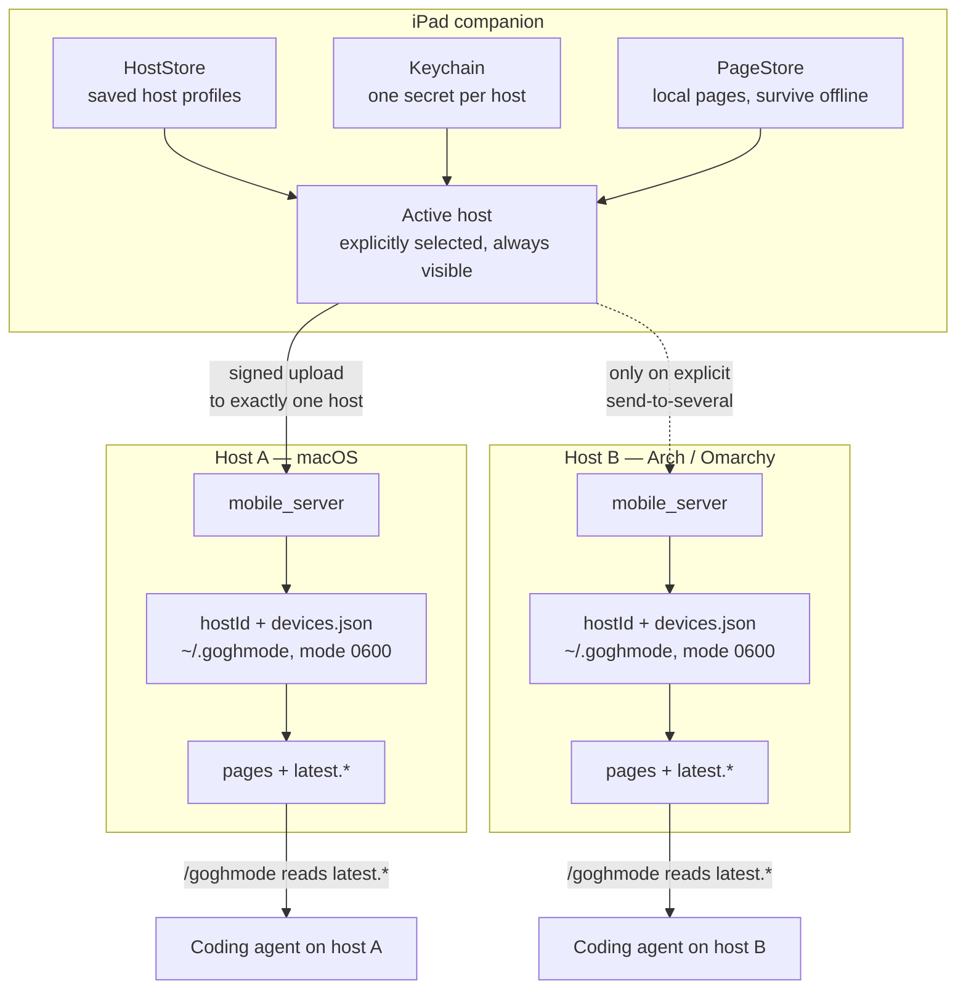

# Multi-Host Companion — Architecture Plan

> **Audience:** developers. The answer to
> [companion-multi-host-planning-prompt.md](companion-multi-host-planning-prompt.md).
> This is a plan, not shipped behaviour — nothing described here exists yet. The decision it
> reaches is recorded as [ADR-0006](decisions/0006-paired-devices-over-shared-url-token.md).

---

## Executive recommendation

Give every desktop host a **stable identity that is not its address**, and give every companion
device its **own secret**, handed over during an explicit pairing step that a human approves on the
host. The companion then keeps a list of saved hosts, shows which one it is talking to at all times,
and sends each drawing to exactly one of them.

Concretely: a host generates a random `hostId` on first launch and keeps it forever. Pairing is a
short-lived, single-use secret shown on the host as a QR code and scanned by the companion. The host
displays "iPad of Desley wants to pair" and waits for a tap. **The device secret is then derived
from the scanned value on both sides and is never transmitted** — a full recording of the pairing
exchange gives an attacker nothing. From then on every upload carries an HMAC-SHA256 over its own
body, a timestamp, and a nonce, and every response carries an HMAC back — so the companion can tell
that it reached the machine it paired with, and not merely *a* machine answering on that address
today.

This is the smallest design that satisfies the stated requirements. It uses one standard primitive,
HMAC-SHA256, with a pre-shared key. There is no public-key infrastructure, no certificate, no
certificate store to manage per device, no invented cryptography, and no new process to run. It is
strictly local: the only network traffic is between the companion and a host on the same network.

Two things it deliberately does **not** do. It does not encrypt drawing contents — the payload
stays cleartext over the local network, exactly as today. That is a real, named residual risk and
the upgrade path (transport-layer security with a certificate pinned at pairing time) is described
rather than taken, because it degrades the browser companion badly for a gain that only matters
against an attacker who is already sniffing your local network. And it does not make one action
send a drawing to more than one host. Fan-out is available only as an explicit, separately confirmed
secondary action, and even then it reports each host's result individually.

The browser companion (`mobile/index.html`) stays on the current secret-URL scheme and is labelled
the lower-trust surface. It is a single HTML file with no build step and deliberately no
credential-handling code; adding key storage and request signing to it would trade its main virtue
for a security property that its threat model — someone already on your network — barely improves.

---

## Feasibility of one URL for two hosts

The prompt asks whether one URL can connect the companion to two hosts. The phrase covers five
different mechanisms, and they do not have the same answer.

| Interpretation | Possible without a backend? | Notes |
| --- | --- | --- |
| One URL that **bootstraps a host configuration** into the app | **Yes** | This is what a pairing link is. It carries the data needed to save a host; it is not a live connection. |
| One URL that **represents a saved host profile** | **Yes** | Today's model. One address, one host, one destination. |
| One URL that **imports a list of hosts** | **Yes** | Encode a small JSON bundle of host profiles into a QR code or a `goghmode://` link. One scan saves both hosts. Still one destination per upload. |
| One URL that **uploads to several hosts at once** | **No** | Not a property a URL can have. A URL resolves to one host and one port. Sending to two machines means the application issuing two requests to two saved profiles. The URL is not what does it. |
| One URL **backed by a relay that fans out** | **Only with a relay** | Requires a process that receives drawings and forwards them. Whether it runs in a data centre or on your own network, it is a third machine holding your handwriting and a new trust boundary. Rejected under the stated no-cloud, no-tunnel constraints; documented below as the labelled non-local alternative. |

**Why the fourth row is a hard no, not a difficult yes.** A URL is an address. Resolving it yields
one address family, one host, one port, one connection. There is no local-network mechanism that
turns one Transmission Control Protocol destination into two delivered copies: multicast is not
connection-oriented and cannot carry an authenticated request-response exchange; a DNS name with two
address records picks one and fails over, it does not duplicate; anycast is a routing construct that
does not exist on a home network. Anything that genuinely delivers one upload to two machines is a
program doing it twice, or a relay doing it on your behalf.

**The safest interpretation, and the recommendation.** *One pairing URL per host*, plus an optional
bundle link purely as an import convenience for someone setting up two machines at once. Multi-host
lives in the companion's saved-host list and its explicit selection, never in the address. This is
the reading that makes accidental fan-out structurally impossible: there is no URL whose meaning is
ambiguous about where a drawing lands.

---

## Current architecture assessment

Written against the code on `master`, which is ahead of the prompt's description — pages shipped,
so the schema is at version 2 and there is a capabilities endpoint.

### What exists

| Area | Current behaviour |
| --- | --- |
| **Desktop host** | Rust with `eframe`/`egui`. Owns the drawings directory, runs the server, holds the token, exports `latest.{json,svg,png}` and per-page copies under `pages/<id>/`. Builds on macOS, passes `cargo check` on Linux. |
| **Server** | `src/mobile_server.rs`. One thread, no framework, no async runtime. Binds `0.0.0.0:8787` with an ephemeral-port fallback. Routes live under `/{token}/`. |
| **Pairing and authentication** | None, in the usual sense. The credential *is* the URL path: 16 bytes from `/dev/urandom`, hex-encoded, persisted at `~/.goghmode/mobile-token`, reused across restarts. No header, no cookie, no origin check, no transport-layer security. Reasoned through in [ADR-0002](decisions/0002-token-in-path-lan-pairing.md). |
| **Validation** | `validate_snapshot` in `src/mobile_server.rs` is the real defence. It names the first failure so a person holding a tablet can act on it, and it rejects a `page.id` that could escape the drawings directory before anything joins it to a path. |
| **Browser companion** | `mobile/index.html`, compiled into the binary with `include_bytes!`. Posts to the relative path `save`, so it needs no credential code at all. |
| **Native iPad companion** | SwiftUI and PencilKit. Stores one endpoint string in `@AppStorage("goghModeEndpoint")`. `GoghModeEndpoint` derives `saveURL` and `capabilitiesURL` from whatever was pasted. `PageStore` persists pages locally, so work survives the host being closed. |
| **Capability probing** | `GET {prefix}capabilities` returns `{"schemaVersions":[1,2],"features":["pages"]}`. A host predating pages has no such route and answers 404, which the companion reads as "version 1 only". This is the pattern the new work should extend rather than replace. |
| **Schema compatibility** | `SUPPORTED_SCHEMA_VERSIONS = [1, 2]`. Version 1 uploads carry no page and are filed under a reserved `legacy` page. Widening rather than bumping is deliberate: three clients cannot be updated together. |

### What does not exist

- **Host identity.** A host is its address. Two machines are distinguishable only by the address
  they happen to be answering on, which changes.
- **Device identity.** The server keeps nothing per device. Every companion that knows the path is
  the same anonymous caller.
- **Revocation.** Rotating the token invalidates every device at once and breaks every saved
  home-screen shortcut. There is no way to remove one device.
- **More than one saved host in the companion.** `@AppStorage("goghModeEndpoint")` is a single
  string. Switching machines means re-pasting a URL.
- **Any notion of a wrong host.** A stale URL that now belongs to a different machine is accepted
  silently; the drawing lands somewhere the user did not intend and looks successful.
- **Multi-host upload.** Not present in any form — which is a good starting position, because
  nothing has to be un-designed.

### Platform-specific code that blocks a Linux host

| Location | Problem |
| --- | --- |
| `src/app.rs:90` | `Command::new("open")` — macOS only. Linux needs `xdg-open`. |
| `src/app_install.rs` | Builds a macOS application bundle and runs `codesign`. Linux needs a user-level desktop entry instead. |
| `src/drawing.rs:48` | `MAC_SCRATCH_PAGE_ID = "mac-scratch"` — the constant name and the visible title are Mac-specific. The **string itself is a directory name on disk** and must not change. |
| `src/skill.rs` | The installed skill text ends with "tap Send to Mac". |
| `mobile/index.html` | "Send to Mac", "Saved to Mac", `sendToMac()`, `#send-mac`. Asserted by `tests/mobile_web_assets.rs:52-56`. |
| Swift UI strings | "Mac URL", "Paste the Mac mobile URL", and every `UploadError` message in `GoghModeClient.swift:101-105` and `UploadController.swift:158-162`. |
| `src/mobile_server.rs:506` | `preferred_lan_ip()` finds the default route by connecting a datagram socket toward `8.8.8.8`. Under a virtual private network that is the tunnel address, not the local-network address, so the displayed URL is unreachable from the tablet. |

One correction to the existing documentation while in the area: the **Known failure modes** table in
[ARCHITECTURE.md](ARCHITECTURE.md) still lists the ephemeral-port fallback as silent. It is not —
`port_warning()` (`src/app.rs:62`) is rendered at `src/app.rs:297`. That row should be updated.

---

## Threat model

### Assets

| Asset | Why it matters |
| --- | --- |
| **Write access to `latest.*`** | **The sharpest asset in the system.** That file is what the coding agent reads. Anyone who can post a drawing controls the agent's input — this is a prompt-injection channel with a filesystem behind it, not merely a defaced sketch. |
| Drawing contents | Handwritten notes. Frequently working notes about the thing being built; occasionally personal. |
| Per-device secrets and the host identity | Compromise means indefinite impersonation of a paired device. |
| The drawings directory as a filesystem location | A path-traversing page identifier would let a caller write outside it. Already defended; must stay defended. |
| Host availability | A host that is trivially wedged by a hostile caller stops being useful. |

### Trust boundaries

1. **The listening socket.** Everything arriving there is untrusted, including from a paired device.
   Authentication changes *who*, never *whether input is validated*.
2. **The pairing channel — a screen and a camera.** Out-of-band and short-lived, which is what makes
   a pre-shared key workable without a certificate authority.
3. **The filesystem.** Page identifiers become directory names. Already a checked boundary.
4. **The agent's read of `latest.*`.** Downstream of everything above and the reason the first asset
   ranks first.

### Attackers and consequences

| Attacker | Capability | Today | With this design |
| --- | --- | --- | --- |
| Another device on the same network | Can reach the port; can scan; can sniff unencrypted traffic | Needs only the path, which sniffing hands over. Full write access. | Cannot forge an upload without a per-device secret that never travels after pairing. |
| A guest-network peer | Same, plus no accountability | Same as above | Same as above. |
| Someone who screenshots or shoulder-surfs the URL | Reads the credential off a screen | Permanent write access; nothing can be revoked short of rotating for everyone | A pairing code is single-use and expires in about two minutes, and using it still requires someone tapping approve on the host. |
| **An active attacker during pairing** | Answers on the host's address, or reads and rewrites every packet of the pairing exchange | Nothing to attack; there is no pairing step | Learns nothing. The secret is derived from a value that went screen-to-camera and was never sent. Cannot forge the pairing signature, so no approval sheet even appears. |
| A stale URL after an address or port change | Passive; the user's own mistake | Silently posts to whatever machine now holds that address | The host identity does not match the saved profile, so the companion refuses and says so. |
| A rogue host impersonating GoghMode | Answers on an address the companion has saved | Indistinguishable from the real host | Cannot produce a valid response HMAC, so the companion never reports success. |
| A compromised companion device | Holds real secrets | Holds the shared token — equivalent to every device | Holds one device's secret. Revoke that device; every other device is unaffected. |
| Hostile or captive network | Can intercept and modify traffic | Can rewrite drawings in flight | Cannot forge or replay a signed upload. **Can still read drawing contents** — the named residual risk. |
| The user selecting the wrong host | Honest error | No feedback; there is only one destination anyway | The destination is named on screen at all times and must be chosen explicitly when more than one host is saved. |
| An offline or replaced host | Availability | Sticky offline state, no recovery path | The page stays queued on the device; nothing reroutes; identity mismatch is reported distinctly from unreachability. |

### Security goals

- No upload is accepted from a device that was never explicitly paired.
- A captured upload cannot be replayed.
- The companion can tell a paired host from a machine merely answering on its address.
- One device can be revoked without disturbing the others.
- The destination of every drawing is visible before it is sent and reported after.
- Being on the same network confers no trust whatsoever.

### Non-goals

- Confidentiality of drawing contents on the wire. Named, not solved. Upgrade path described.
- Protecting against an attacker who already has a shell on the host or the tablet.
- Accounts, cloud storage, remote access from outside the local network.
- Denial-of-service resistance beyond the existing body-size and validation limits.

---

## Design alternatives

| | 1 · Secret URL over plain transport (today) | 2 · Host profiles with explicit pairing (**recommended**) | 3 · QR pairing with public-key host identity | 4 · Relay with fan-out |
| --- | --- | --- | --- | --- |
| **Security** | Weak. One shared secret, visible in history, screenshots, and on the wire. | Good. Per-device secrets, signed and replay-protected requests, host proves possession. | Strongest for host identity; also lets a host be recognised without ever having shared a secret. | Depends wholly on the relay, which becomes the most attractive target. |
| **Privacy** | Cleartext locally | Cleartext locally | Cleartext locally unless transport security is added too | Drawings pass through and may rest on a third machine |
| **Complexity** | None; already built | Moderate. One primitive, one registry file, one pairing screen. | High. Key generation, storage, and verification in Rust, Swift, and any other client; a key-rotation story. | High, plus a process to deploy, monitor, and keep alive. |
| **Local-only** | Yes | Yes | Yes | **No** |
| **macOS and Linux** | Equal | Equal — a file and a standard primitive behave the same on both | Key storage diverges per platform (Keychain, file, possibly a secret service) | Equal, and equally irrelevant |
| **User experience** | Paste a URL | Scan a code, tap approve once per device | Same as 2 from the outside; the difference is invisible to the user | Best on paper, worst in failure modes |
| **Multi-host** | One at a time | Native: a list of saved hosts | Native | Native, and dangerously implicit |
| **Revocation** | All-or-nothing | Per device, immediate | Per device, immediate | Whatever the relay implements |
| **Address-change recovery** | None; re-paste and hope | Identity is separate from address, so an address change is a profile update | Same | Handled by the relay |
| **Migration cost** | — | Additive. New routes beside the old ones; nothing existing breaks. | Same shape, more code in every client | A rewrite of the trust model |

**Why not design 3.** It is genuinely stronger in one specific way: a host can prove its identity to
a companion that has never held a shared secret. That property matters when pairing happens over an
untrusted channel. Here, pairing happens by pointing a camera at a screen in the same room — the
channel is already out-of-band and already authenticated by physical presence. Paying for
public-key identity in three languages, with key storage, rotation, and verification in each, buys
almost nothing on top of a secret exchanged that way. If pairing ever needs to work remotely, design
3 is the correct next step and the protocol below is shaped so it can be swapped in: `hostId` becomes
a key fingerprint and the message authentication code becomes a signature, with no change to the flow
or the user experience.

**Why not design 4.** It is the only design that literally delivers "one URL, two hosts", and it
costs the property the whole project is built on. A relay receives drawings. Even self-hosted on the
same network, it is a machine that holds handwriting, must be kept running, must be updated, and can
be compromised independently. It is recorded here as the labelled non-local alternative and is not
recommended.

---

## Recommended architecture



The solid arrow is the normal path: one drawing, one selected host. The dotted arrow exists only
behind an explicit, separately confirmed action.

Each host is fully independent. There is no coordination between hosts, no shared state, and no
awareness of each other. A host does not know how many companions exist beyond its own device
registry, and does not know that another host exists at all. That independence is what keeps the
failure modes simple: a host being offline is only ever a fact about that host.

---

## Pairing and authentication protocol

### Host identity

On first launch a host generates 16 random bytes and stores them hex-encoded at
`~/.goghmode/host-id` with permissions `0600`. This is `hostId`, and it never changes — not when the
address changes, not when the port changes, not when the token is rotated. Alongside it the host
keeps a user-editable display name, defaulting to the system hostname, and a platform string of
`macos` or `linux`.

Deriving identity from anything observable — address, port, hostname, network hardware address —
was rejected. All of them change, and a companion cannot distinguish "my host moved" from "a
different machine is here now" if identity is the thing that moved.

### Pairing

**The secret is never transmitted.** This is the single most important property of the flow. The QR
code carries a high-entropy value that travels from a screen to a camera and never touches the
network; both sides derive the long-lived device secret from it independently. An attacker who can
read, modify, or answer every packet during pairing — a rogue access point, an address-resolution
spoof, a machine that has taken over the host's address — still learns nothing, because the only
thing that would have been worth capturing was never sent.

An earlier draft of this plan had the host return the device secret in the pairing response. That
would have put the root of trust for the entire system in one cleartext message, which is precisely
the attacker the rest of the design defends against. It is fixed here.

1. The user opens **Pair a device** on the host. The host generates a single-use `pairingSecret` of
   16 random bytes with a lifetime of roughly 120 seconds, and shows it as a QR code and as text for
   manual entry.
2. The QR payload is compact JSON:

   ```json
   {
     "v": 1,
     "hostId": "9f2c…",
     "name": "Desley's MacBook",
     "platform": "macos",
     "addresses": ["192.168.1.10:8787", "10.13.0.4:8787"],
     "pairingSecret": "b71e…"
   }
   ```

   Every candidate local address is listed, not just the one `preferred_lan_ip()` guesses, so a
   companion on a different interface can still reach the host.
3. The companion generates its own `deviceId` and derives, without contacting anything:

   ```
   deviceSecret = HMAC-SHA256(pairingSecret, "goghmode-device-v1" ‖ deviceId)
   ```

   Using HMAC as a key-derivation function is sound here because the input key is a single uniformly
   random 128-bit value. The label pins the derivation to one purpose and one version.
4. It posts `POST /v2/pair` with `hostId`, `deviceId`, a device name, its platform, and

   ```
   X-GoghMode-Pair-Mac: HMAC-SHA256(pairingSecret, "pair" ‖ hostId ‖ deviceId ‖ deviceName)
   ```

   The host recomputes it. A caller that never saw the QR cannot produce it, so a request that fails
   this check never reaches a human — it is answered `403` and dropped, and no approval sheet
   appears. This also means the approval dialog cannot be used as a nuisance channel by anything on
   the network.
5. **The host asks a person.** A sheet appears naming the device and its address; nothing is granted
   until someone taps approve. The device name is attacker-supplied text, so it is length-limited
   and stripped of control characters before it is displayed.
6. On approval the host derives the same `deviceSecret` with the same formula, stores it in the
   device registry, burns the `pairingSecret`, and replies with the `hostId`, the host display name,
   the platform, and

   ```
   X-GoghMode-Pair-Mac: HMAC-SHA256(pairingSecret, "paired" ‖ hostId ‖ deviceId)
   ```

   The companion verifies that before saving anything. It proves the machine that answered holds the
   value from the screen the user was looking at — so pairing authenticates the host as well as the
   device, in the same exchange, at no extra cost.
7. Denial, expiry, a reused secret, and a wrong message authentication code are all answered `403`
   with an identical body, so a caller cannot tell them apart.

A leaked pairing secret is close to harmless: single-use, roughly two minutes, and using it still
requires a human at the host to approve a device they can see named on screen. A leaked *screenshot*
of the QR is the one case worth naming — it is a real credential for those two minutes, which is why
the lifetime is short and the approval is mandatory.

### Device registry

`~/.goghmode/devices.json`, permissions `0600`, written with the same
write-temporary-then-rename pattern the exporter already uses:

```json
{
  "devices": [
    {
      "deviceId": "…",
      "deviceName": "iPad of Desley",
      "platform": "ipados",
      "secret": "…",
      "pairedAt": 1785000000000,
      "lastSeenAt": 1785000600000,
      "lastAcceptedTimestamp": 1785000600000
    }
  ]
}
```

`lastAcceptedTimestamp` is what makes replay protection survive a restart — see below.

The desktop shows this as a device list with last-seen times. Revoking is removing the entry, and it
takes effect on the next request. No expiry, no renewal, no refresh flow — a device stays paired
until a person removes it, which is what someone actually expects of their own tablet.

### Authenticated upload

`POST /v2/save`, body identical to today's `DrawingSnapshot`, with four headers:

| Header | Contents |
| --- | --- |
| `X-GoghMode-Device` | `deviceId` |
| `X-GoghMode-Timestamp` | Milliseconds since the Unix epoch |
| `X-GoghMode-Nonce` | 16 random bytes, hex-encoded |
| `X-GoghMode-Mac` | `HMAC-SHA256(deviceSecret, deviceId ‖ timestamp ‖ nonce ‖ hostId ‖ SHA-256(body))` |

Fields are joined with a separator that cannot appear inside any of them, so no two distinct field
sets can produce the same signed string.

The host verifies in this exact order, and answers a **single generic `401`** for every
authentication failure so that a caller learns nothing from which check failed:

1. `deviceId` is a known, unrevoked device.
2. The timestamp is within ±120 seconds of the host clock.
3. **The timestamp is strictly greater than that device's `lastAcceptedTimestamp`.**
4. The message authentication code matches, compared in constant time.
5. Only now is the body handed to `serde_json`.

**Order matters and step 5 is the point.** Hashing a body is cheap and parsing it is not. If parsing
came first, an unauthenticated caller could make the host parse 4 MiB of adversarial JSON on every
request — authentication that runs after the expensive work protects nothing. The body is read under
the existing 4 MiB cap, digested, and checked before anything interprets it.

**Why a persisted monotonic timestamp rather than a set of seen nonces.** A nonce set lives in
memory, so restarting the host empties it and a request captured moments earlier can be replayed
into the fresh process. It is also a collection an attacker can grow. Requiring each device's
timestamp to strictly increase needs one number, is persisted in a registry that is written anyway,
and closes the restart window completely. The companion's uploads are already serialised — a single
in-flight request at a time — so strict monotonicity costs nothing in practice. The nonce stays in
the signed string because the *response* proof below binds to it.

Including `hostId` in the signed string is what stops a captured request from being replayed against
a *different* host. Including the body digest is what stops the drawing from being swapped for
another.

Then `validate_snapshot` runs exactly as it does today. Authentication changes who may call; it does
not reduce validation by one check.

### The host proves itself

Every `/v2/save` response carries:

```
X-GoghMode-Host-Mac: HMAC-SHA256(deviceSecret, "response" ‖ nonce ‖ statusCode)
```

The companion verifies it **before** it shows "Saved". A missing or wrong value means the machine
that answered does not hold the secret — it is not the host that was paired with. The companion says
so explicitly and distinctly from an ordinary failure, and does not mark the page as sent.

This is the answer to "how does the companion verify that the selected host is the intended host".
It costs one extra header and one hash, and it converts an unnoticeable wrong-machine upload into an
unmissable error. Binding it to the client's nonce is what makes it a live proof rather than a value
that could be replayed from an earlier exchange.

### What `/v2/hello` says, and to whom

An **unauthenticated** caller gets protocol facts only:

```json
{"v": 1, "schemaVersions": [1, 2], "features": ["pages", "pairing-v2"], "time": 1785000600000}
```

No `hostId`, no display name. A stable identifier handed to anyone who can reach the port is a
tracking value for a laptop that joins many networks, and nothing needs it before pairing — during
pairing the identity arrives in the QR code, and afterwards it is already saved.

A **signed** request to the same route additionally returns `hostId`, the display name, and the
platform, so a paired companion can confirm identity and refresh a changed display name.

`time` is deliberately public. A host whose clock is wrong rejects every upload, and because
authentication failures are opaque by design that would otherwise be undiagnosable. With this, the
companion compares clocks and says "this host's clock is 4 minutes behind" instead of showing a
generic failure that looks like a bug. Revealing a clock aids no attack the local network does not
already permit.

### Primitives and storage

- **HMAC-SHA256 only.** On the host, the RustCrypto `hmac` and `sha2` crates — widely reviewed, no
  transitive weight, and both compile everywhere the project already builds. On iPadOS, CryptoKit's
  `HMAC<SHA256>`. Nothing is hand-rolled.
- **Randomness** comes from the same `/dev/urandom` read the token already uses, which works on both
  target platforms. The existing time-and-process-identifier fallback in `random_token` is
  acceptable for a token but **not** for a secret; if the random source is unavailable, pairing must
  fail loudly rather than produce a guessable secret.
- **Host storage** is a `0600` file. Using the macOS Keychain here was considered and rejected for
  now: it diverges the two platforms for a secret that sits beside an unencrypted drawings directory
  anyway, and the file is far easier to inspect, back up, and reason about.
- **Companion storage** is the Keychain, non-syncing, so a secret does not travel to other devices
  through backup.

### Errors

| Situation | Response |
| --- | --- |
| Any authentication failure | `401`, generic body, no detail about which check failed |
| Device known but revoked | `401`, identical to the above |
| Valid signature, invalid snapshot | `400` with the named reason, exactly as today |
| Pairing secret wrong, expired, reused, unsigned, or denied | `403`, identical in all five cases |
| Write failure | `500` |

Authentication failures are deliberately opaque; validation failures are deliberately specific. The
first is talking to a possible attacker, the second to a person holding a tablet.

---

## Multi-host behaviour

| Situation | Behaviour |
| --- | --- |
| **No saved hosts** | The app shows pairing. Nothing can be sent. |
| **One saved host** | Selected automatically. Its name is shown in the toolbar. Behaves exactly like today. |
| **Two or more saved hosts** | One must be selected. The selection persists across launches and is shown at all times as a chip with the host name, a platform badge, and a reachability dot. |
| **Selected host unreachable** | The page stays queued locally — `PageStore` already persists it — and retries. Status reads "waiting for *Desley's MacBook*", naming the host. **It never reroutes to another host.** |
| **Identity mismatch** | Distinct from unreachable. "The machine at 192.168.1.10 is not *Desley's MacBook*." Offers re-pair or update-address, never a silent retry. |
| **Send to several hosts** | A secondary action only. Multi-select sheet, explicit confirmation naming each destination, then one independent signed request per host. |
| **Partial success** | Reported per host: "Sent to *MacBook*. *Framework* did not answer." No aggregate success, no silent retry against the hosts that worked. |
| **Retries** | Per host, independent, bounded. A failure against one host never triggers a request to another. |
| **Duplicate uploads** | Idempotent per host, per page: a page identifier is a directory, and the same page overwrites its own copy. Last write wins on that host only. |
| **Ordering** | Not coordinated across hosts and does not need to be. Each host holds its own mirror. |

Page identifiers are `UUID` values generated on the iPad (`PageStore.appendPage`), so two hosts
holding the same page identifier means they hold mirrors of the same page. There is no cross-host
collision to design against.

**Should "send to all" exist at all?** It should not exist as *all*. A blanket destination is
exactly the ambiguity the prompt warns about, and the failure is silent by nature: it succeeds
loudly and mis-delivers quietly. An explicit "send to these two, confirmed, reported separately" is
a different thing — the user names the destinations each time. Whether even that is worth building
is left as an open decision below, because the honest answer may be that selecting a host and
sending twice is fine.

---

## Cross-platform architecture

### Shared, in Rust, with no platform conditionals

The server and its routes, the pairing protocol, identity generation and persistence, the device
registry, message authentication, replay protection, snapshot validation, the page store, and the
export pipeline. All of it is standard-library plus the two crypto crates, and none of it needs to
know which operating system it is on.

### Platform-specific, isolated behind a narrow interface

| Concern | macOS | Linux |
| --- | --- | --- |
| Reveal the drawings folder | `open` | `xdg-open` |
| Install | Application bundle in `~/Applications`, `codesign` (`src/app_install.rs`) | Desktop entry at `~/.local/share/applications/goghmode.desktop`, icon under `~/.local/share/icons/hicolor/` |
| Launch | Bundle launcher script | Desktop entry, or the binary directly |
| Secret storage | `~/.goghmode/*` mode `0600` | Identical |
| Output paths | `~/Pictures/GoghMode/drawings` | **Same path** — see open decisions |

The right shape is one function per concern, selected with `#[cfg(target_os = …)]` at a single point
each, rather than conditionals scattered through the user-interface code. `install_macos_app` becomes
`install_app` with two implementations behind it.

### Removing Mac-specific assumptions

- **User-visible wording** becomes host-neutral everywhere: "host", "desktop", or the host's own
  display name, which is strictly better than either — "Sent to *Desley's MacBook*" is more useful
  than "Sent to Mac" ever was. Covers `src/app.rs`, `src/skill.rs`, the Swift strings in
  `GoghModeClient.swift:101-105` and `UploadController.swift:158-162`, `ContentView.swift:89-103`,
  and the copy in `mobile/index.html`.
- **`tests/mobile_web_assets.rs:52-56`** asserts the "Send to Mac" strings and moves with the copy.
- **`MAC_SCRATCH_PAGE_ID`** (`src/drawing.rs:48`) is renamed to `DESKTOP_SCRATCH_PAGE_ID` and its
  title becomes "Desktop scratch", but **the string value `"mac-scratch"` stays exactly as it is**.
  It is a directory name that already exists on disk; changing it orphans every existing scratch
  page. This is the one place where the Mac-specific name is load-bearing, and renaming it would be
  a silent data loss dressed up as a cleanup.
- **Network interface selection** (`src/mobile_server.rs:506`) stops guessing. Enumerate the
  interfaces, prefer non-loopback addresses in private ranges, put **every** candidate in the
  pairing payload's `addresses` list so the companion can try each, and offer a picker when more
  than one plausible candidate exists. This is what makes a virtual private network, a change of
  network, or a machine with several interfaces survivable rather than mysterious.
- **The `/goghmode` skill contract does not change on either platform.** `latest.{json,svg,png}` in
  the same location keeps meaning what it means. That is the single most important compatibility
  guarantee in the project and nothing here touches it.

---

## Omarchy deployment plan

### Build and install

```bash
cargo build --release
install -Dm755 target/release/goghmode ~/.local/bin/goghmode
goghmode install-app     # writes the desktop entry and icon; Linux branch of install_app
```

The desktop entry is written to `~/.local/share/applications/goghmode.desktop`:

```ini
[Desktop Entry]
Type=Application
Name=GoghMode
Comment=Local sketchpad for terminal AI workflows
Exec=%h/.local/bin/goghmode
Icon=goghmode
Terminal=false
Categories=Graphics;Utility;
```

**Nothing under `~/.local/share/omarchy/` is read, written, or referenced.** Everything the
installer touches is either a standard per-user directory that Omarchy does not manage, or inside
`~/.goghmode/`.

### Autostart

**Not enabled, and not offered by default.** An autostarted host is a socket listening for as long
as someone is logged in, whether or not a drawing is ever made. The current model — the server lives
exactly as long as the window — is a genuine security property and worth more than saving one
launch. Anyone who wants it can add an `exec-once` line to their own Hyprland configuration; the
documentation should say why the project does not do it for them.

### Firewall

Omarchy generally ships `ufw`. Scope the rule to the local network rather than opening the port to
every interface:

```bash
sudo ufw allow from 192.168.1.0/24 to any port 8787 proto tcp comment 'GoghMode companion'
```

Substitute the actual local-network range. A bare `ufw allow 8787` also opens the port on any
virtual private network interface, which is exactly the hostile-network case in the threat model.

### Network behaviour

Address changes are expected and no longer destructive: the host identity is stable, so a companion
that reaches a host at a new address recognises it and updates the profile. A virtual private network
is the reason `preferred_lan_ip()` must stop guessing — listing every candidate address in the
pairing payload makes an interface change recoverable without re-pairing.

### Storage, diagnostics, and revocation

| What | Where |
| --- | --- |
| Host identity, device registry, legacy token | `~/.goghmode/`, mode `0600` |
| Drawings | `~/Pictures/GoghMode/drawings/` |
| Logs | stderr today; `~/.local/state/goghmode/` if file logging is ever added |

Stopping the host is quitting the application — the listener dies with the window. Revoking one
device is removing it from the device list in the desktop user interface. Recovering from a leaked
secret is revoking that device and pairing again, which affects no other device. Deleting
`~/.goghmode/devices.json` revokes everything at once.

### One item to verify before this ships

`eframe` 0.34 must be built with its Wayland backend enabled for Hyprland. The project passes
`cargo check` on Linux today, which does not prove the window opens. First Linux task: run it.

---

## Migration plan

Additive throughout. Every stage leaves the previous one working.

| Stage | Host | iPad companion | Browser companion | Existing users |
| --- | --- | --- | --- | --- |
| **1 · Identity** | Generates `hostId`; adds `/v2/hello`; advertises `features: ["pages", "pairing-v2"]` | Unchanged | Unchanged | Nothing changes |
| **2 · Pairing available** | `/v2/pair` and `/v2/save` live; `/{token}/save` behaves exactly as today **while no device is paired** | Ships pairing; prefers version 2 when advertised, falls back to the token URL when not | Unchanged | Nothing changes until they pair |
| **3 · First pairing closes the old door** | The first successful pairing **turns the legacy route off**, with a visible notice and a toggle to re-enable it | Unchanged | Stops working on that host once a device is paired, unless the toggle is used | Their choice, reversible, and announced at the moment it happens |
| **4 · Legacy retired** | The toggle is removed once the browser companion's future is decided | Unchanged | Needs the URL scheme decision resolved first | Announced in advance |

**Why stage 3 is not merely an opt-out.** An earlier draft left the unauthenticated route on by
default until the very end. That is a bypass: everything the pairing work buys is worthless while a
second door accepts anonymous uploads to the same drawings directory, and "no unauthenticated local
server" is a stated hard requirement. Tying the change to the first successful pairing is what makes
the security real without stranding anyone — nothing changes for a user who has not adopted the new
flow, and the moment they do, the old door closes and they are told so.

- **Existing browser URLs** keep working through stage 3 and are the reason stage 4 needs its own
  decision — the browser companion has no pairing path by design.
- **Existing iPad endpoints** keep working. A companion that has not paired behaves exactly as it
  does today.
- **`~/.goghmode/mobile-token`** is untouched. It coexists with `host-id` and `devices.json`.
- **Saved drawings, page directories, schema version 1 and 2 snapshots** — all unchanged. This work
  does not touch the snapshot format at all.
- **The `/goghmode` skill** never observes any of this. `latest.*` keeps its meaning throughout.
- **New Linux users** start at stage 2 and never see the legacy path.

The capability probe makes the whole thing self-negotiating: a companion asks what a host accepts
rather than inferring it from a rejection, which is the pattern already shipped for pages and the
reason this migration needs no version coordination between the three clients.

---

## Implementation phases

Ordered, not scheduled. Phase 0 is independent of everything else and can ship on its own.

A convention that shapes every phase: **this is a binary-only crate with no `lib.rs`**. Integration
tests re-include source files with `#[path = "../src/x.rs"] mod x;`. A new module means another
`#[path]` line in each test file that needs it, not an export.

### Phase 0 — Linux host and host-neutral wording

- **Goal.** GoghMode runs as a first-class host on Arch/Omarchy, and nothing user-visible claims the
  host is a Mac.
- **Files.** `src/app.rs` (reveal), `src/app_install.rs` (split into `install_app` with two
  implementations), `src/drawing.rs` (constant rename, string value unchanged), `src/skill.rs`,
  `mobile/index.html`, the Swift string sites, `tests/mobile_web_assets.rs`, `docs/`.
- **API and data.** None. No protocol change, no schema change, no on-disk change.
- **Security.** Confirm the desktop-entry `Exec` path cannot be influenced by anything but the
  installing user. No new network surface.
- **Tests.** Existing suite green on both platforms; a test asserting the Linux installer writes
  only under `~/.local/share/applications` and `~/.local/share/icons`; a test asserting
  `DESKTOP_SCRATCH_PAGE_ID == "mac-scratch"` so a future rename cannot silently orphan directories.
- **Exit.** The application builds, launches, draws, exports, and reveals its folder on Arch under
  Hyprland; `cargo test` passes on both platforms; no user-visible string says "Mac" except a host's
  own display name.

### Phase 1 — Host identity and device registry

- **Goal.** A host knows who it is and which devices it has ever trusted. Nothing authenticates yet.
- **Files.** New `src/host_identity.rs` and `src/devices.rs`; `src/mobile_server.rs` gains
  `/v2/hello`; `src/app.rs` gains a host-name field and a device list.
- **API.** `GET /v2/hello` → `{v, schemaVersions, features, time}` unauthenticated; `hostId`, name and
  platform are added only for a signed request. `/capabilities` advertises `pairing-v2`.
- **Security.** Both files created `0600`; refuse to start pairing if the random source is
  unavailable; the display name is user-controlled text and must be length-limited before it enters
  a response.
- **Tests.** Identity persists across restarts; permissions are `0600`; a corrupt identity file is
  regenerated rather than crashing; the registry survives a partial write via the existing
  temporary-then-rename pattern; an unauthenticated `/v2/hello` response contains no `hostId`.
- **Exit.** Two hosts on one network report different identities; `latest.*` behaviour is
  bit-for-bit unchanged.

### Phase 2 — Pairing

- **Goal.** A device can be paired, approved by a person, listed, and revoked.
- **Files.** New `src/pairing.rs`; server route; desktop pairing sheet, QR rendering, device list;
  Swift `HostStore`, Keychain storage, QR scanner, manual-code entry.
- **API.** `POST /v2/pair`.
- **Security.** The device secret is **derived, never transmitted**. The pair request is signed under
  the pairing secret, so an unsigned or wrongly signed request is dropped before any approval sheet
  is shown. Single-use, ~120-second lifetime, constant-time comparison, human approval mandatory,
  identical `403` for denied, expired, reused, unsigned, and wrong. The device name is
  length-limited and stripped of control characters before display. Rate-limit attempts. **The first
  successful pairing disables the legacy route** and says so.
- **Tests.** The pairing secret never appears in any response body or header. A pair request with no
  signature, or one signed with the wrong secret, is refused **without** raising an approval prompt.
  The secret expires; it cannot be reused; denial and expiry are indistinguishable on the wire;
  concurrent attempts do not both succeed on one secret; host and companion derive byte-identical
  device secrets; a revoked device disappears from the registry; the legacy route stops accepting
  uploads after the first pairing and resumes if the toggle is used.
- **Exit.** An iPad pairs with two hosts, both appear in its host list, revoking one leaves the
  other untouched, and a packet capture of the entire pairing exchange contains nothing that lets a
  third party upload afterwards.

### Phase 3 — Authenticated upload

- **Goal.** A paired device can upload; nothing else can.
- **Files.** `src/mobile_server.rs` (`/v2/save`, verification, nonce set), Swift request signing and
  response verification.
- **API.** `POST /v2/save` with the four headers; every response carries `X-GoghMode-Host-Mac`.
- **Security.** The whole point of the plan. Constant-time comparison; per-device strictly increasing
  timestamps persisted in the registry; ±120-second clock skew; generic `401`; **the body is
  digested and verified before `serde_json` ever sees it**; `validate_snapshot` still runs
  afterward, unchanged.
- **Tests.** A correct request succeeds. Wrong secret, wrong device, revoked device, absent headers,
  a timestamp outside the window, a **replayed timestamp**, a body altered after signing, and a
  signature captured from another host all fail with an identical `401`. A request captured and
  replayed **after the host restarts** still fails. A malformed body under an invalid signature is
  rejected without being parsed. A tampered or absent host response message authentication code is
  surfaced by the companion as an identity error, not a success. The existing multi-packet upload
  regression in `tests/mobile_server.rs` still passes against the new route.
- **Exit.** `curl` cannot post a drawing without a secret; a captured valid request replayed a minute
  later is refused; the legacy token route still works exactly as before.

### Phase 4 — Multi-host in the companion

- **Goal.** The companion holds several hosts, and the destination is never in doubt.
- **Files.** Swift `HostStore`, `UploadController` (per-host state), `ContentView` (host chip,
  switcher, pairing entry point).
- **API.** None; this phase is client-side.
- **Security.** Never auto-select on failure; identity mismatch reported distinctly from
  unreachability; the destination is on screen before and after every send.
- **Tests.** Selection persists across launches; an offline host queues and never reroutes; an
  identity mismatch blocks the upload; the same page uploaded to two hosts leaves each with its own
  independent mirror.
- **Exit.** Two hosts saved, switching between them takes one tap, and at no point is it unclear
  where a drawing went.

### Phase 5 — Explicit send to several hosts *(optional — see open decisions)*

- **Goal.** Send one page to named hosts in one action, with honest per-host reporting.
- **Files.** Swift only.
- **Security.** Off by default; every destination named in the confirmation; per-host results; no
  aggregate success message; no cross-host retry.
- **Tests.** One host accepts and one refuses → both reported, neither hidden; one host offline →
  named as such; the failure of one triggers no request to the other.
- **Exit.** It is impossible to send to several hosts without having read their names on a
  confirmation screen.

### Phase 6 — Legacy sunset and documentation

- **Goal.** The old path becomes a deliberate choice rather than the default.
- **Files.** `src/mobile_server.rs`, `src/app.rs`, `docs/` including
  [ADR-0006](decisions/0006-paired-devices-over-shared-url-token.md),
  [ADR-0002](decisions/0002-token-in-path-lan-pairing.md) status,
  [mobile-server-api](specs/components/mobile-server-api.md),
  [ipad-companion](specs/pages/ipad-companion.md), [ARCHITECTURE.md](ARCHITECTURE.md).
- **Exit.** The desktop clearly states which surfaces are authenticated and which are not, and the
  documentation says the same thing.

### Phase 7 — Optional hardening

- Service discovery over multicast DNS (`_goghmode._tcp`, `hostId` in the text record) so a moved
  host is found rather than re-entered. Weigh against the discovery surface it adds.
- The network-interface picker, if Phase 0's candidate list proves insufficient.
- Transport-layer security with a certificate pinned at pairing time, if drawing confidentiality
  ever becomes a requirement.

---

## Open decisions

These genuinely need a human answer; everything else above is decided.

1. **Does Phase 5 ship at all?** Selecting a host and sending twice is not much worse, and it is
   impossible to get wrong. Recommendation: build Phases 0–4, live with them, and decide afterwards.
2. **The Linux drawings directory.** `~/Pictures/GoghMode/drawings` on both platforms keeps the
   skill contract a single string, at the cost of ignoring `XDG_PICTURES_DIR`. Recommendation: one
   path on both platforms; the value of the agent contract being one literal exceeds the value of
   the convention.
3. **When does the legacy token route go off by default?** It is the browser companion's only path,
   so this is really a decision about the browser companion's future.
4. **Is multicast DNS discovery worth its surface?** It removes the last piece of manual address
   handling and adds a service advertisement to every network the host joins.
5. **Does the desktop application need its own device entry?** It writes directly to the drawings
   directory and never uses the network. Recommendation: no — inventing a loopback client for it
   would add a code path with no user.

---

## Final acceptance criteria

**Security**

- [ ] An unpaired caller on the network cannot write a drawing on any host.
- [ ] A captured valid upload replayed after the window is refused.
- [ ] A captured valid upload replayed against a *different* host is refused.
- [ ] Every authentication failure returns an identical, uninformative `401`.
- [ ] **A full packet capture of a pairing exchange yields nothing that allows a later upload.** The
      device secret is derived on both sides and never appears on the network.
- [ ] A pair request that is unsigned or wrongly signed is refused **without** showing an approval
      prompt.
- [ ] A pairing secret cannot be used twice, cannot be used after expiry, and cannot be used without
      a person approving on the host.
- [ ] A request captured and replayed after the host restarts is still refused.
- [ ] An invalid signature means the body is never parsed.
- [ ] An unauthenticated `/v2/hello` reveals no persistent host identifier.
- [ ] Once a device is paired, the legacy unauthenticated route stops accepting uploads unless it is
      deliberately re-enabled.
- [ ] Revoking one device takes effect on its next request and disturbs no other device.
- [ ] `~/.goghmode/host-id` and `~/.goghmode/devices.json` are mode `0600`.
- [ ] The companion refuses to report success when the host response message authentication code is
      absent or wrong.
- [ ] Path-traversing page identifiers are still refused, and still refused before anything reaches
      the filesystem.

**Multi-host**

- [ ] Two hosts can be paired and both are listed.
- [ ] With two or more hosts saved, a destination must be chosen explicitly.
- [ ] The destination is visible before and after every send.
- [ ] An unreachable host queues locally and never reroutes.
- [ ] A host answering with an unexpected identity blocks the upload and says why.
- [ ] No action sends to more than one host without naming each destination on a confirmation
      screen.

**Cross-platform**

- [ ] The host builds, launches, draws, exports, and reveals its folder on macOS and on
      Arch/Omarchy under Hyprland.
- [ ] `cargo test` and `cargo clippy` pass on both platforms.
- [ ] The Linux installer writes nothing outside standard per-user directories and nothing under
      `~/.local/share/omarchy/`.
- [ ] No user-visible string names a platform except a host's own display name.
- [ ] The on-disk page identifier `"mac-scratch"` is unchanged.

**Compatibility**

- [ ] An unmodified browser companion still works against a host running the new code.
- [ ] An iPad build from before this work still works against a host running the new code.
- [ ] Schema version 1 and 2 snapshots are accepted exactly as before.
- [ ] `latest.{json,svg,png}` keep their location, format, and meaning; the `/goghmode` skill needs
      no change.
- [ ] Existing page directories are readable and listed after upgrading.

---

## Related

- [companion-multi-host-planning-prompt.md](companion-multi-host-planning-prompt.md) — the question
  this document answers
- [ADR-0006 · Paired devices over a shared URL token](decisions/0006-paired-devices-over-shared-url-token.md)
- [ADR-0002 · The pairing token is the URL path](decisions/0002-token-in-path-lan-pairing.md) — what
  this supersedes, and for which surfaces
- [mobile-server-api](specs/components/mobile-server-api.md) · [ipad-companion](specs/pages/ipad-companion.md) · [ARCHITECTURE.md](ARCHITECTURE.md) · [PLANNING.md](PLANNING.md)
